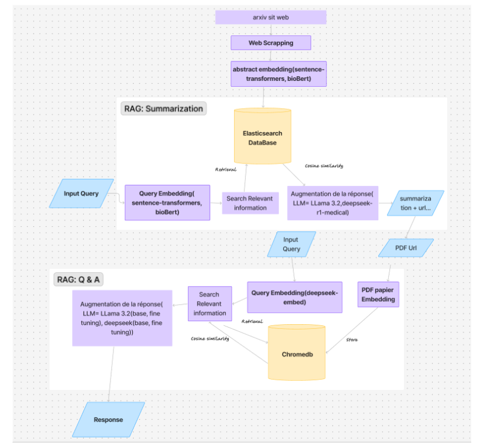

# 🧠 NeuroMed AI – MedicalSearch  

**Smart Medical Research Assistant powered by Retrieval-Augmented Generation (RAG)**  

This project builds a RAG pipeline for **summarization** and **question-answering** over scientific / medical papers (mainly from arXiv).  
It integrates **web scraping, embeddings, vector databases, and LLMs** to deliver concise research summaries, relevant URLs, and detailed answers from PDFs.  

---

## 📊 System Architecture



---

## 📂 Repository Structure
```bash
medicalSearch/
│
├── Scraping/ # Web scraping modules for arXiv / papers
├── Rag_Summary/ # Summarization pipeline
├── Qa-Bot/ # Question-answering over PDFs
├── Neuro-Med-app/ # Application / API / frontend
├── Murag/ # Experiments / alternative implementations
├── Extracted_Images/ # Assets & diagrams
├── .env # Environment variables
├── .gitignore
└── README.md # Project documentation
```
---

## 🚀 Features

- **Web Scraping**: Collects abstracts and PDFs from arXiv.  
- **Embedding Models**: Supports `sentence-transformers`, `bioBERT`, and `deepseek-embed`.  
- **Vector Databases**:  
  - **Elasticsearch** → Abstracts & metadata storage.  
  - **Chromedb** → PDF embeddings & retrieval.  
- **Summarization (RAG)**: Retrieves abstracts and generates concise summaries with paper URLs.  
- **Q&A (RAG)**: Answers detailed questions by retrieving relevant PDF passages.  
- **LLM Augmentation**: Uses **LLaMA 3.2** and **DeepSeek (medical / fine-tuned)** for improved responses.  

---

## ⚙️ Installation

### Prerequisites
- Python ≥ 3.8  
- pip / conda  
- Running **Elasticsearch** instance  
- **Chromedb** (or other vector DB)  
- GPU (recommended for embeddings & LLMs)  

### Setup

1. Clone the repository:
   ```sh
   git clone https://github.com/sara-bm/medicalSearch.git
   cd medicalSearch
   ```
2. Create a virtual environment:
   ```sh
   python -m venv venv
   source venv/bin/activate   # macOS/Linux
   # .\venv\Scripts\activate  # Windows
   ```
3. Install dependencies:
   ```sh
   pip install -r requirements.txt
   ```
4. Configure environment variables in a .env file:
   ```sh
   ELASTICSEARCH_URL=http://localhost:9200
   ELASTICSEARCH_USER=your_user
   ELASTICSEARCH_PASSWORD=your_password
   CHROMEDB_PATH=./chromedb
   OPENAI_API_KEY=your_api_key
   MODEL_PATH=./models
   ```
## ▶️ Usage

1. Scraping Papers
   Run the scraper to fetch abstracts & PDFs:
   ```bash
   python Scraping/run_scraper.py
   ```

2. Summarization
   Get a summary + paper URLs for a query:
   ```bash
   python Rag_Summary/summarize.py --query "latest research on mRNA vaccines"
   ```

3. Q&A :
   Answer detailed questions from PDFs:
   ```bash
   python Qa-Bot/qa.py --query "What side effects were reported in mRNA vaccine studies?"
   ```

4. Run Streamlit  App :
   ```bash
      cd Neuro-Med-app
      uvicorn app:app --reload
   ```

## 🔧 Customization

* Embeddings: Swap between BioBERT, SciBERT, or Sentence-BERT.
* LLMs: Replace or fine-tune LLaMA / DeepSeek.
* Retrieval: Adjust similarity thresholds & top-k results.
* PDF Splitting: Tune chunk size for document embeddings.

## 📦 Dependencies
Key libraries:

* transformers, sentence-transformers, bioBERT
* elasticsearch, chromadb
* uvicorn, fastapi (for API)
* pdfplumber / PyPDF2 (PDF parsing)
* scikit-learn or faiss (similarity search)

# Install all via:
```sh
pip install -r requirements.txt
```
## ✅ Example Workflow

1. Scrape new papers from arXiv.
2. Index abstracts in Elasticsearch.
3. Embed full-text PDFs into Chromadb.
4. User asks: “What are the risks of long-term AI use in radiology?”
5. Summarizer returns summary + URLs.
6. QA module retrieves PDFs & answers in detail.

## 📌 Limitations

* Depends on scraped datasets (limited coverage).
* Risk of hallucinations from LLM.
* PDF parsing may introduce noise.
* Latency when processing large PDFs.

## 🤝 Contributing

-  Fork the project.
- Create your feature branch (git checkout -b feature/new-feature).
- Commit your changes (git commit -m 'Add new feature').
- Push to the branch (git push origin feature/new-feature).
- Open a Pull Request.

## 📜 License
- MIT License
## ✨ Citation
If you use this project in research, please cite:
```sh
textNeuroMed / medicalSearch (2025).
"RAG pipeline for medical literature summarization & Q&A."
GitHub Repository: https://github.com/sara-bm/medicalSearch
```
